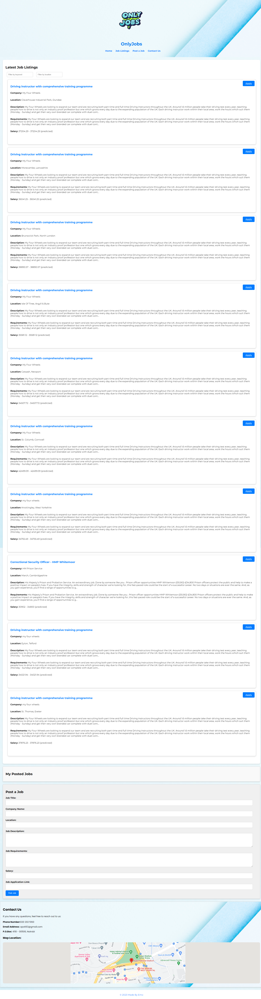

# Job-Board-Project---Phase-1
Simple job board project for my phase one final project

# OnlyJobs - Job Listings Website

OnlyJobs is a job listings website that provides you with the latest  job opportunities. You can search for jobs, post job listings, and apply for positions directly from our platform.

## Features
- Display avaliable job listings using the Adzuna API
- Search for  jobs based on keywords and location.
- Apply for any job you are interested in using the apply option.
- Post  job listings for other developers to see.
- Contact us for inquiries or support.

## Technologies Used

- HTML
- CSS
- JavaScript
- Adzuna API (for job listings)
- Google Maps API (for location)

## How to Use

1. Clone this repository to your local machine.
2. Open the `index.html` file in your web browser to access the OnlyJobs website.
3. Browse job listings, apply filters, and explore job opportunities.

## Contributions

Contributions to this project are welcome. Feel free to open issues, suggest improvements, or submit pull requests.

## License
